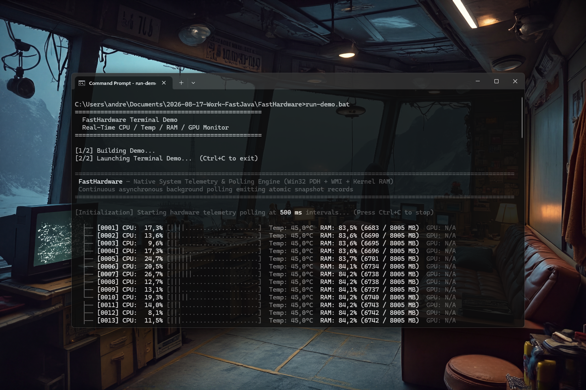

# FastHardware 0.1.1 [ALPHA-2026-09-02] — Native Hardware Telemetry API for Java

[](https://github.com/andrestubbe/FastHardware/releases/tag/0.1.1)
[](https://opensource.org/licenses/MIT)
[](https://www.java.com)
[]()
[](https://jitpack.io/#andrestubbe/FastHardware)

---

**⚡ Zero-overhead native hardware telemetry for Java.**

**FastHardware** gives your Java application direct access to real-time system health — CPU usage, CPU temperature, physical RAM, and GPU temperature — without shelling out to `wmic`, without polling `OperatingSystemMXBean`, and without spawning background processes. By binding directly to Win32 PDH counters and WMI COM objects via JNI, it delivers accurate, low-latency hardware telemetry at native speed.

[**Watch the Demo (YouTube)**](https://youtu.be/86PBTGlfCXk)

[](https://youtu.be/86PBTGlfCXk)

---

## Quick Start

```java
import fasthardware.FastHardware;
import fasthardware.HardwareSnapshot;

public class Example {
    public static void main(String[] args) throws InterruptedException {
        // 1. Create monitor instance (initializes native PDH + WMI once)
        FastHardware hw = FastHardware.create();

        // 2. Option A: Continuous background polling with callbacks
        hw.startPolling(500, snapshot -> {
            System.out.printf("CPU: %5.1f%% | Temp: %4.1f°C | RAM Free: %d MB%n",
                snapshot.cpuUsagePercent(),
                snapshot.cpuTemperatureCelsius(),
                snapshot.freeRamBytes() / 1024 / 1024);
        });

        Thread.sleep(5000);
        hw.stopPolling();

        // 3. Option B: Atomic synchronous pull
        HardwareSnapshot snap = hw.getSnapshot();
        System.out.printf("Instant CPU: %.1f%%%n", snap.cpuUsagePercent());
    }
}
```

---

## Table of Contents

- [Why FastHardware?](#why-fasthardware)
- [Key Features](#key-features)
- [Real-Life Examples](#real-life-examples)
- [Performance Benchmarks](#performance-benchmarks)
- [API Quick Reference](#api-quick-reference)
- [Examples & Demos](#examples--demos)
- [Installation](#installation)
- [Documentation](#documentation)
- [Platform Support](#platform-support)
- [License](#license)
- [Related Projects](#related-projects)

---

## Why FastHardware?

Standard Java approaches to hardware monitoring have fundamental limitations when used in production:

- **`OperatingSystemMXBean`**: Only provides a 1-minute rolling load average (`getSystemLoadAverage()`) — not real-time CPU usage. Has no temperature, no per-core data, and no physical RAM (only JVM heap).
- **`Runtime.freeMemory()`**: Reports JVM heap free memory only — completely unrelated to OS-level physical RAM.
- **`wmic` / process spawning**: Executes a child process per call. Startup overhead is ~100–300 ms per query, utterly unsuitable for polling loops.
- **No thermal sensor API**: Java has zero built-in access to CPU or GPU temperature. There is no standard API — full stop.

**FastHardware** solves all of these by going directly to the OS:

- **True CPU Usage**: PDH counter `\\Processor(_Total)\\% Processor Time` — registered once at startup, polled in microseconds for every subsequent call. Real-time, not delayed.
- **Physical RAM**: Win32 `GlobalMemoryStatusEx` — a direct kernel memory table read in nanoseconds, returns actual OS-level free and total physical RAM.
- **Temperature**: WMI `MSAcpi_ThermalZoneTemperature` in the `ROOT\WMI` namespace — native ACPI thermal zone readings via COM without any process spawn.
- **Per-Core CPU**: One PDH counter per logical core, all polled in a single JNI call, returned as a `double[]`.

---

## Key Features

- **📊 Real-Time Telemetry** — CPU%, per-core CPU%, CPU temperature, physical free RAM, total RAM, GPU temperature.
- **⚡ Native Win32 Speed** — PDH counters registered once, polled in microseconds. RAM via `GlobalMemoryStatusEx`. Temperatures via WMI ACPI.
- **🧊 Zero Heap Allocation** — All JNI calls use primitives (`jlong`, `jdouble`, `jdoubleArray`). No objects allocated per query. GC-invisible hot path.
- **📦 Atomic Snapshot** — `getSnapshot()` captures all fields in a single native round-trip and returns a frozen `HardwareSnapshot` record.
- **🔌 Auto-Loading Native** — `fasthardware.dll` is embedded inside the JAR. `FastCore` extracts and loads it automatically at runtime — no manual DLL path management.
- **🖥️ Ecosystem Ready** — Integrates cleanly into the FastJava ecosystem. Feed telemetry into `FastAgent`, drive adaptive quality in `FastAnimation`, or gate resource-intensive `FastGPU` kernels.

---

## Real-Life Examples

**System Health Dashboard** — poll every 500 ms and print live data:
```java
FastHardware hw = FastHardware.create();
hw.getSnapshot(); Thread.sleep(1100); // warm up PDH

while (true) {
    HardwareSnapshot s = hw.getSnapshot();
    System.out.printf("\rCPU: %4.1f%%  Temp: %2.0f°C  RAM: %4.0f MB free",
        s.cpuUsagePercent(),
        s.cpuTemperatureCelsius(),
        s.freeRamBytes() / 1024.0 / 1024.0);
    Thread.sleep(500);
}
```

**Adaptive Quality Gate** — throttle workload when system is under pressure:
```java
FastHardware hw = FastHardware.create();

public void onTick() {
    double cpu = hw.getGlobalCpuUsage();
    long freeRam = hw.getFreeMemoryBytes();

    if (cpu > 85.0 || freeRam < 512 * 1024 * 1024L) {
        renderEngine.setQuality(Quality.LOW);   // back off
    } else {
        renderEngine.setQuality(Quality.HIGH);  // full power
    }
}
```

**Per-Core Imbalance Detection** — find overloaded cores:
```java
double[] cores = hw.getPerCoreCpuUsage();
for (int i = 0; i < cores.length; i++) {
    if (cores[i] > 90.0) {
        System.out.printf("⚠ Core %d overloaded: %.1f%%%n", i, cores[i]);
    }
}
```

---

## Performance Benchmarks

FastHardware is profiled using **JMH** against standard Java equivalents. Run `run-benchmark.bat` for live numbers.

| Metric | Java JMX / Runtime | FastHardware Native | Notes |
|--------|--------------------|---------------------|-------|
| Full telemetry snapshot | 3× separate MXBean calls | **1× atomic JNI call** | PDH + WMI + RAM in one trip |
| CPU usage | `getSystemLoadAverage()` (1-min rolling) | **PDH instantaneous** | Real-time vs. delayed average |
| Per-core CPU | ❌ Not available | **`double[]` per logical core** | FastHardware exclusive |
| Free RAM | `Runtime.freeMemory()` (JVM heap only) | **`GlobalMemoryStatusEx` (physical)** | OS-level, not JVM-scoped |
| CPU temperature | ❌ Not available | **WMI ACPI `ROOT\WMI`** | FastHardware exclusive |
| GPU temperature | ❌ Not available | **WMI (discrete GPUs)** | FastHardware exclusive |

> [!NOTE]
> CPU temperature accuracy depends on BIOS ACPI implementation. Intel integrated GPU platforms may report static ACPI thermal zone values — this is a firmware limitation, not a FastHardware bug. Discrete NVIDIA/AMD GPUs and desktop motherboards typically provide continuously updating values.

*Measured on Windows 11, Intel Core i5-1135G7 (Surface Pro 8), JDK 21.0.12.*

---

## API Quick Reference

### `FastHardware` (Interface)

| Method | Returns | Description |
|--------|---------|-------------|
| `FastHardware.create()` | `FastHardware` | Initializes native PDH + WMI and returns a monitor instance. |
| `startPolling(intervalMs, listener)` | `void` | Starts continuous async background polling emitting atomic `HardwareSnapshot` records. |
| `stopPolling()` | `void` | Stops any active background polling loop. |
| `isPolling()` | `boolean` | Returns `true` if continuous polling is active. |
| `getSnapshot()` | `HardwareSnapshot` | Atomic synchronous read of all telemetry in one native call. |
| `getGlobalCpuUsage()` | `double` | CPU usage 0.0–100.0 via PDH `\\Processor(_Total)`. |
| `getPerCoreCpuUsage()` | `double[]` | Per-logical-core CPU usage via PDH. |
| `getTotalMemoryBytes()` | `long` | Total physical RAM via `GlobalMemoryStatusEx`. |
| `getFreeMemoryBytes()` | `long` | Free physical RAM via `GlobalMemoryStatusEx`. |
| `getCpuTemperatureCelsius()` | `double` | CPU temperature via WMI ACPI `ROOT\WMI`. |
| `getGpuTemperatureCelsius()` | `double` | GPU temperature via WMI (0.0 if not available). |

### `HardwareSnapshot` (Record)

```java
record HardwareSnapshot(
    double   cpuUsagePercent,
    double[] perCoreCpuUsage,
    long     usedRamBytes,
    long     totalRamBytes,
    double   cpuTemperatureCelsius,
    double   gpuTemperatureCelsius
) {
    long freeRamBytes(); // totalRamBytes - usedRamBytes
}
```

---

## Examples & Demos

| Case | Java Example | Launcher | Description |
|------|--------------|----------|-------------|
| **Live Terminal Dashboard** | [Demo.java](examples/Demo/src/main/java/fasthardware/Demo.java) | `run-demo.bat` | ANSI terminal monitor — CPU%, CPU°C, RAM, GPU°C as neon bars + scrolling sparklines. Pure FastHardware, no extra deps. |
| **JMH Benchmark Suite** | [Benchmark.java](examples/Benchmark/src/main/java/fasthardware/benchmark/Benchmark.java) | `run-benchmark.bat` | 7-group JMH throughput suite — FastHardware native vs Java JMX/Runtime across all telemetry dimensions. |

---

## Installation

### Option 1: Maven (Recommended)

Add the JitPack repository and the dependency to your `pom.xml`:

```xml
<repositories>
    <repository>
        <id>jitpack.io</id>
        <url>https://jitpack.io</url>
    </repository>
</repositories>

<dependencies>
    <!-- FastHardware Library -->
    <dependency>
        <groupId>com.github.andrestubbe</groupId>
        <artifactId>FastHardware</artifactId>
        <version>0.1.1</version>
    </dependency>
    <!-- FastCore — Required Native JNI Loader -->
    <dependency>
        <groupId>com.github.andrestubbe</groupId>
        <artifactId>FastCore</artifactId>
        <version>0.1.0</version>
    </dependency>
</dependencies>
```

### Option 2: Gradle (via JitPack)

```groovy
repositories {
    maven { url 'https://jitpack.io' }
}

dependencies {
    implementation 'com.github.andrestubbe:FastHardware:0.1.1'
    implementation 'com.github.andrestubbe:FastCore:0.1.0'
}
```

### Option 3: Direct Download (No Build Tool)

1. 📦 **[FastHardware-0.1.1.jar](https://github.com/andrestubbe/FastHardware/releases/download/0.1.1/FastHardware-0.1.1.jar)** — The Core Library
2. ⚙️ **[fastcore-0.1.0.jar](https://github.com/andrestubbe/FastCore/releases/download/0.1.0/fastcore-0.1.0.jar)** — Required Native JNI Loader

> [!IMPORTANT]
> Both JARs must be on your classpath. `FastCore` extracts `fasthardware.dll` to `%USERPROFILE%\.fastcore\native\fasthardware\` at runtime automatically.

---

## Documentation

* **[ARCHITECTURE.md](docs/ARCHITECTURE.md)**: Win32 PDH, WMI COM bridge, and JNI boundary architecture.
* **[REFERENCE.md](docs/REFERENCE.md)**: Full API specification and JNI contracts.
* **[COMPILE.md](docs/COMPILE.md)**: Build guide for compiling the native DLL from C++ source.
* **[PHILOSOPHY.md](docs/PHILOSOPHY.md)**: Why native-first telemetry matters for Java performance monitoring.
* **[CHANGELOG.md](docs/CHANGELOG.md)**: Version history and release notes.
* **[ROADMAP.md](docs/ROADMAP.md)**: Planned milestones (NVAPI, ADL, async background poller).

---

## Platform Support

| Platform | Status |
|----------|--------|
| Windows 10 / 11 (x64) | ✅ Fully Supported |
| Linux | 🚧 Planned |
| macOS | 🚧 Planned |

---

## License

MIT License — See [LICENSE](LICENSE) for details.

---

## Related Projects

- [FastCore](https://github.com/andrestubbe/FastCore) — Required native JNI DLL loader (auto-extracts `fasthardware.dll` at runtime)
- [FastDisplay](https://github.com/andrestubbe/FastDisplay) — Native display detection: refresh rate, resolution, EDID, HDR (Win32 DXGI/EnumDisplayDevices)
- [FastDWM](https://github.com/andrestubbe/FastDWM) — Windows DWM bridge: VSync, title bar theming, WinMM 1ms timers
- [FastGPU](https://github.com/andrestubbe/FastGPU) — Vulkan compute kernel dispatch — pair with FastHardware to gate GPU workloads on thermal state

---

**Part of the FastJava Ecosystem** — *Making the JVM faster. Small package. Maximum speed. Zero bloat. 🚀🔋*